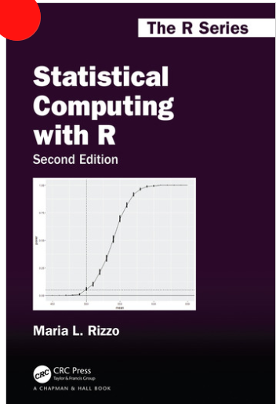

```{r,setup, include=FALSE}
knitr::opts_chunk$set(cache=TRUE)
```

# Course Outline

## Lecture schedule

We meet twice a week on WebEx:

  - **Tuesday** 10am to 11:20am
    + Traditional Lecture
  - **Thursday** 10am to 11:20am
    + Discussion & Question Period
    
Both weekly meetings will be **recorded** and available on UM Learn

## Personal Work

  - We won't have time to cover all the material with only one lecture per week.
    + You're responsible for covering the *other half* of the material on your own.
    + Mainly through **interactive tutorials** (more on this later), but keep an eye on UM Learn for quizzes, extra course notes, examples, exercises, etc.
    
## Textbook



## Assessments

  - **Goal**: More, lower-stake assessments (instead of a couple high-stake exams).
    + 6 assignments (10% each)
    + 2 midterms and 1 final (15% each)
    + Class participation (5%)

## Assignments

  - Assignments will be **entirely** done with Rmarkdown.
    + So are the slides!
  - Your "zero-th" assignment is due next Monday.
    + It isn't worth any point, it's just to make sure that your computer can create PDF files from Rmarkdown files.
    + Follow the instructions on UM Learn
    
## By the way, should I already know `R`?

  - Short answer: you should have learned `R` in STAT 2150.
  - Slightly longer answer: forgetting is human, we'll relearn together as needed.
    + Concepts will be introduced as needed, and through examples.
    + See UM Learn for extra reading material on `R`.
  - **Important**: Let me know if some of the code isn't clear!
    + In particular, Thursdays can be used to go into more detail.

## Class participation

  - Two equally weighted components: 
    + Summary quizzes on UM Learn (one per module + academic integrity)
    + In-class participation/Discussion groups
  

## What is statistical computing? {.allowframebreaks}

  - At a basic level, statistical computing is *using computational tools* to solve *statistical problems*.
    + It is an integral part of modern statistics.
  - **But what kind of problems?**

\vspace{1cm}
  
  - Let's say you derived the asymptotic distribution of an estimator. *How well does it perform in finite sample sizes?*
    + Generate multiple datasets under the model and compute your estimator to get an estimate of the distribution.
    
\vspace{1in}
    
  - You're doing Bayesian modeling. *How do I compute the posterior distribution of my parameters?*
    + Use importance sampling and/or Monte Carlo integration.
    + **STAT 4150**: Construct a Markov chain whose stationary distribution is your posterior distribution.
  - I don't think the assumptions are met. *How do I get valid confidence intervals and hypothesis tests?*
    + Use bootstrap and/or permutation tests.
  - My estimator has no closed-form solution. *How do I compute it?*
    + Use optimisation methods.

